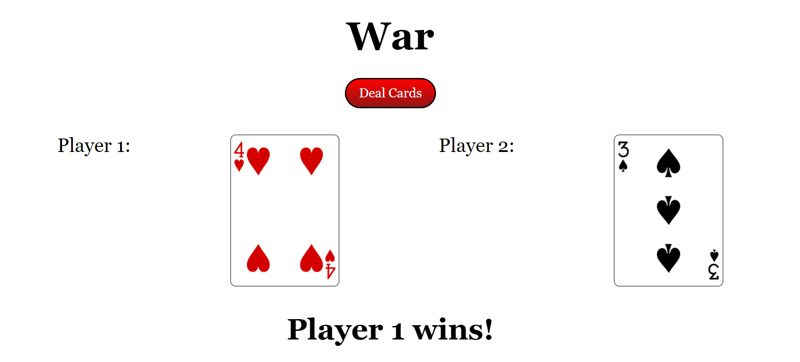

# WarPlay

A simple web application that allows users digitally simulate 1 round of the cardgame "War".

## Features
- Input ISBN to search for a book
- Display book's title, author, cover image, and ISBN
- Store book information in local storage

## Technologies Used
- HTML
- CSS
- JavaScript
- [DeckOfCards Api](https://deckofcardsapi.com/)

### How to Use
[Click here to use demo](https://wraytheon.github.io/simpleWarCardGame/)

Click the "Deal Cards" button to generate two cards and see which one wins.

### Contributing
Contributions to the project are welcome. To contribute, follow these steps:

1. Fork the repository.
2. Create a new branch with a descriptive name for your feature or bug fix.
3. Make changes to the code.
4. Test your changes to make sure they work as expected.
5. Commit your changes.
6. Push your changes to your fork.
7. Submit a pull request.

#### Licensing
This project is licensed under the MIT License.